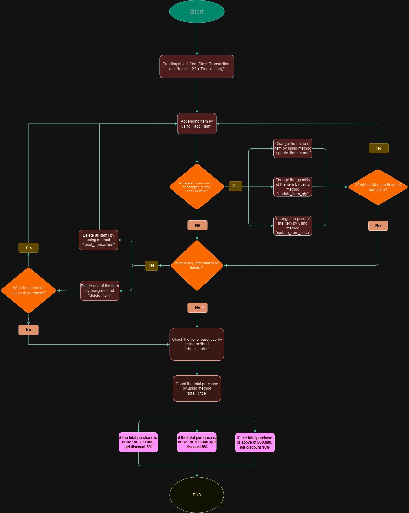
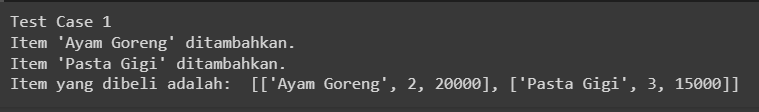
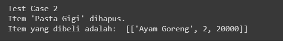
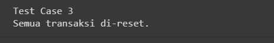
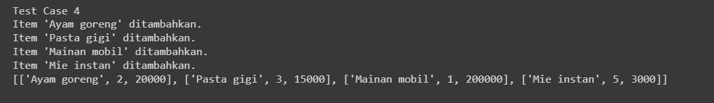
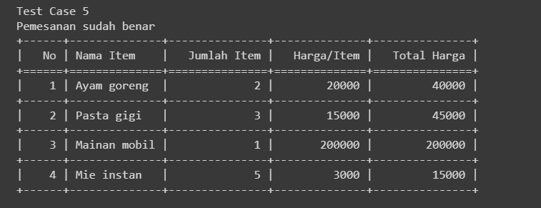
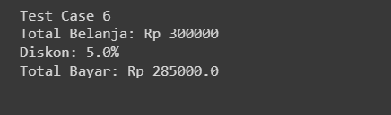

#### Tool Dan Referensi Github

  &nbsp;&nbsp;
&nbsp;&nbsp;
&nbsp;&nbsp;
&nbsp;&nbsp;
&nbsp;&nbsp;
&nbsp;&nbsp;
&nbsp;&nbsp;

# 
<strong>Hi there :wave: , I'm Goo!</strong>

## Background Problems
A supermarket owner named Andi has plans to improve his business by creating a self-service cashier system. The system allows customers to input the items purchased, the number of items, the price of the items, and other features. So, Andi needs a programmer to create the cashier system.

## Objectives
This project aims to create a self-service cashier system with the following flow :

1. The customers create a customer transaction ID.
2. Customers input the name of the item, quantity of items, and price of the item purchased.
3. If it turns out there was an error in entering the item name, item quantity, or item price, the customer can change or update the item :
    - update the item name
    - update the number of items
    - update the item price
4. If the customers cancel to purchase an item, customers can delete the item:
    - delete 1 item
    - reset all transactions
5. If the customers have finished purchasing, but are still unsure whether the price of the goods and name entered are correct, the customers can check the order with the following output:
    - Issue the message "Order is correct" if there are no input errors.
    - Issue the message "There is a data input error" if an input error occurs.
    - Displays a table containing all order data.
6. Finally, customers can display the total price or total purchase to be paid and the discount obtained (if any).

## Flowchart

## Explanation of Attributes and Methods

1. 	The `items` attribute has a `list type,` used to store all items in the transaction.
2. 	The `total_price` attribute has the `float type,` used to store the total price of an item after discounts.
3. 	The `discount` attribute has the `float type,` used to store the total amount of discount obtained.
4. 	The `self.items` attribute is a reference to the items attribute in the instance (object) created.
5. 	The `self.total_price` attribute is a reference to the `total_price` attribute in the instance (object) created.
6. 	The `self.discount` attribute is a reference to the discount attribute in the instance (object) created.
7. 	Method `add_item(self, item)` to `add items` to the transaction into a list of items containing three elements, including: `item name [0], number of items [1], and price per item [2]`.
8. 	The `update_item_name(self, item_name, new_item)` method is used to update the item name. It has two parameters, `item_name` is the name of a previously existing `item,` and `new_item` is the name of the `new item`.
9. 	The `update_item_quantity(self, item_name, new_quantity)` method is used to update the number of `items`. It has two parameters, item_name is the name of the item whose quantity you want to update, and new_quantity is the number of new items.
10. The `update_item_price(self, item_name, new_price)` method is used to update the item price. It has two parameters, `item_name` is the name of the item whose price you want to update, and new_price is the price of the new item.
11. Method `delete_item(self, item_name)` to delete items from the transaction. The `item_name` parameter is the name of the item you want to delete.
12.	Method `reset_transaction(self)` to empty or delete all items from the shopping cart. 
13. Method `check_order(self)` is a method to display all orders that have been made in table form containing `item number, item name, number of items, price per item, and total price` (multiplication of number of items and price per item).
14.	`Calculate_total_price(self)` is a method to calculate the total price and discount obtained from all items that have been added to the items list. This method processes a 10% discount if the total purchase is more than IDR 500,000.00, 8% if the total purchase is more than IDR 300,000.00, or 5% if the total purchase is more than IDR 200,000.00.

# Test Case
## Test Case 1
Add 2 items using the `add_item` method.

**The input is:** 
## Test Case 1
`print("Test Case 1")`

`trnsct_123.add_item(["Ayam Goreng", 2, 20000])`
`trnsct_123.add_item(["Pasta Gigi", 3, 15000])`
`print("Item yang dibeli adalah: ", trnsct_123.items)`

**The output is:** 

## Test Case 2
Deletes items using the `delete_item` method.

**The input is:** 
## Test Case 2
`print("Test Case 2")`

`trnsct_123.delete_item("Pasta Gigi")`
`print("Item yang dibeli adalah: ", trnsct_123.items)`

**The output is:** 

## Test Case 3
Deletes all items using the `reset_transaction` method.

**The input is:** 
## Test Case 3
`print("Test Case 3")`

`trnsct_123.reset_transaction()`

**The output is:** 

## Test Case 4
Add shopping items with the `add_item` method.

**The input is:** 
## Test Case 4
`print("Test Case 4")`

## Test Case 4
`print("Test Case 4")`

`trnsct_123.add_item(["Ayam goreng", 2, 20000])`
`trnsct_123.add_item(["Pasta gigi", 3, 15000])`
`trnsct_123.add_item(["Mainan mobil", 1, 200000])`
`trnsct_123.add_item(["Mie instan", 5, 3000])`
`print(trnsct_123.items)`
`print(" ")`

**The output is:** 

## Test Case 5
Order shopping check orders using the `check_order` method.

**The input is:** 
## Test Case 5
`print("Test Case 5")`
`trnsct_123.check_order()`

**The output is:** 

## Test Case 6
calculate total expenditure with the `total_price` method.

**The input is:** 
## Test Case 6
`print("Test Case 6")`

`trnsct_123.total_price()`
`print(" ")`

**The output is:** 

## Conclusion

Self-service cashier system is created using the Python programming language to make it easier for customers to carry out shopping transactions. This system has some features such as adding items, updating item names, updating the number of items, updating item prices, deleting one item, deleting all items, calculating the total item price and discounts obtained, and displaying a shopping table.

